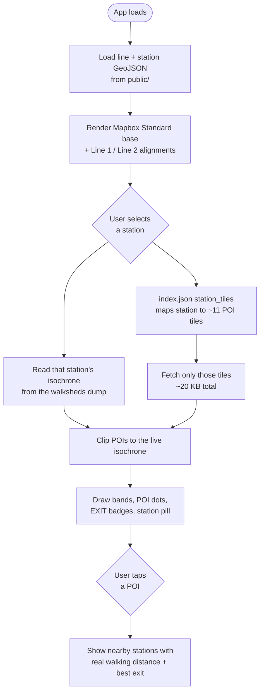

# Architecture

Walksheds is a static single-page app. There is no backend at runtime — every byte is served from GitHub Pages, and the only live network calls are to Mapbox for the base map tiles and (when a station has no cached walkshed) the Isochrone API.

## Stack

| Layer | Choice |
| --- | --- |
| Framework | React + Vite |
| Map | `react-map-gl` (a wrapper over Mapbox GL JS) |
| Base style | `mapbox://styles/mapbox/standard`, `theme: default`, `lightPreset: day` (dusk in dark mode) |
| Walksheds | Mapbox Isochrone API, pre-baked into a committed dump |
| Hosting | GitHub Pages at [walksheds.xyz](https://walksheds.xyz) |
| Tests | Vitest + jsdom + React Testing Library; Playwright for smoke; pytest for the data build |

The dev server runs on port **5187** (`npm run dev`). See [Commands](commands.md) for the full list.

## Runtime data flow

The app loads a small set of static GeoJSON up front, then streams POIs on demand per station so it never pulls the full ~12 MB dataset.

The key performance idea is **spatial tiling** (see [INV-019](invariants.md) and [Refined POIs](data/refined-pois.md)): the full POI set is partitioned into a grid of `public/pois/tiles/{col}_{row}.geojson` files, and `index.json` carries a precomputed `station_tiles` map so the runtime jumps straight from a selected station to the handful of tiles it needs.

## Key frontend modules

| File | Responsibility |
| --- | --- |
| `src/Walksheds.jsx` | The app shell — map, state, station selection, layer orchestration. |
| `src/LineLegend.jsx` | The on-map legend and control bar (dark mode, units, hints, the codex link, walkshed band toggles). |
| `src/constants.js` | Line colors, walkshed styles + opacities, POI categories, map center/zoom. |
| `src/stationIcons.js` | Station pill markers generated as SVG at runtime, light + dark variants. |
| `src/StationPill.jsx` | The roundel + stop-code + name pill used across the UI. |
| `src/routeGraph.js` | Station adjacency along each line, for keyboard and swipe navigation. |
| `src/poiTiles.js` | Loads the spatial tile grid and resolves a station to its tiles. |
| `src/poiUtils.js` | POI filtering, tag availability, chip ordering. |
| `src/stationExits.js` | Straight-line nearest-exit logic (`nearestExit`), computed live in the browser. |
| `src/StationExitMarkers.jsx` | The floating green "EXIT" badges, with best-exit highlighting. |

## Design constraints that shape the code

- **Offline-first builds.** The committed raw dumps mean CI and local builds never depend on a flaky upstream. Network access is opt-in via `--refresh` flags.
- **Append-only invariants.** Data contracts are numbered `INV-NNN`, never renumbered, and most are enforced by tests. See [Core invariants](invariants.md).
- **Transit-cartography house style.** New UI reuses the existing station-pill / line-color vocabulary rather than inventing ornament. See [Design system](design-system.md).
- **No emoji, anywhere** ([INV-018](invariants.md)) — real iconography (inline SVG, the station sprite drawer) or typographic marks instead.
