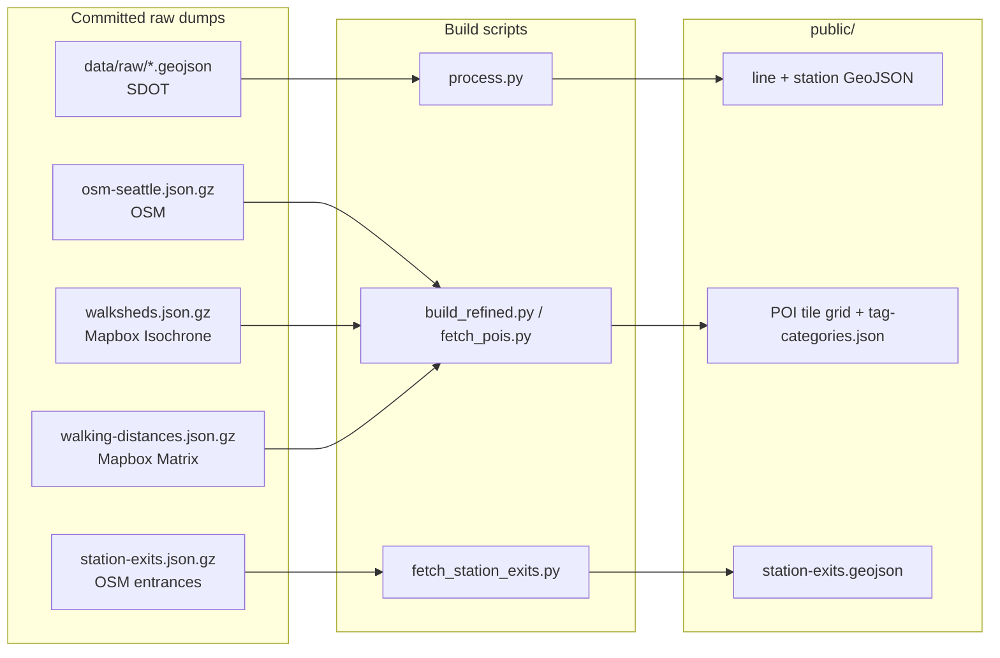

# Data pipeline — overview

Every layer on the map is a static asset built offline from a committed source dump. The guiding principle: **a normal build needs no network**. Each source has a `--refresh` path that re-pulls from upstream, and a default path that rebuilds deterministically from the committed raw data.

## The five sources

| Source | Raw dump | Build script | Output | Page |
| --- | --- | --- | --- | --- |
| SDOT alignment + stations | `data/raw/*.geojson` | `data/process.py` | line + station GeoJSON | [Transit](transit.md) |
| OpenStreetMap POIs | `data/pois/raw/osm-seattle.json.gz` | `fetch_pois.py` | per-category GeoJSON | [POIs](pois.md) |
| OSM + Overture (production) | OSM dump + Overture S3 | `build_refined.py` | spatial tile grid | [Refined POIs](refined-pois.md) |
| Mapbox Isochrone + Matrix | `walksheds.json.gz`, `walking-distances.json.gz` | `fetch_walksheds.py`, `fetch_walking_distances.py` | walkshed polygons + `stations[]` arrays | [Walksheds](walksheds.md) |
| OSM station entrances | `data/pois/raw/station-exits.json.gz` | `fetch_station_exits.py` | `station-exits.geojson` | [Station exits](station-exits.md) |

## Refresh order

When POIs change, refresh in this order so downstream caches stay consistent:

1. `python3 data/pois/fetch_pois.py --refresh` — re-pull the OSM dump and rebuild.
2. `python3 data/pois/fetch_walking_distances.py --refresh` — fetch Matrix entries for any new POI ids inside a walkshed (incremental; caches per pair).
3. `python3 data/pois/fetch_walksheds.py --refresh` — only when **station coordinates** change.

The walkshed dump carries a `version` (a sha1). Downstream caches key off it: if the walkshed version changes, the walking-distance cache invalidates wholesale ([INV-009](../invariants.md)).

## Why dumps are committed

Committing the raw Overpass and Mapbox dumps means:

- CI and contributors build the exact same data without API keys or network flakiness.
- Refreshes are explicit, reviewable diffs — you can see precisely what changed upstream.
- The expensive, rate-limited calls (Overpass, Mapbox Matrix) happen once and are cached.

The full POI dataset (around 26k POIs, every tag) is preserved across the spatial tiles even though the runtime only ever loads a handful at a time. See [Refined POIs](refined-pois.md) and [INV-019](../invariants.md).
