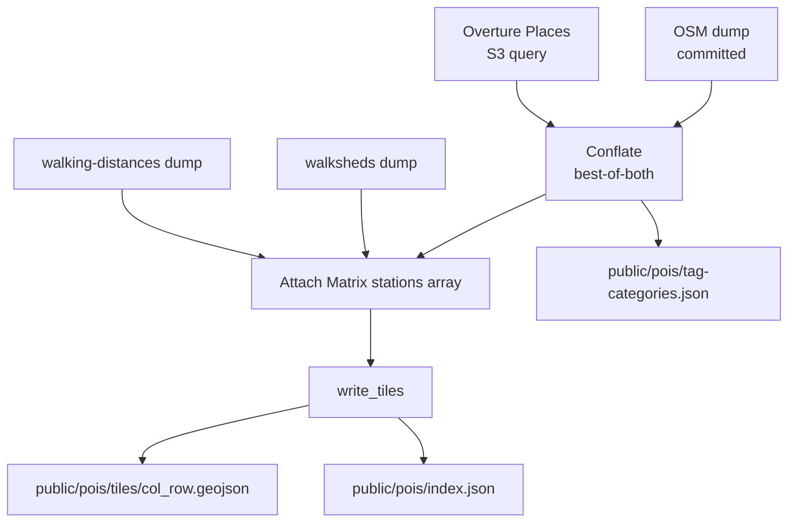

# Refined POIs + spatial tiles

`data/pois/build_refined.py` is the **production** POI build. It conflates OpenStreetMap with Overture Places, attaches real walking distances, and emits the dataset only as a spatial tile grid — never as one big file. This is what the live app loads.

## What it does

Conflation is best-of-both: Overture contributes contact data, OSM contributes hours and qualifier tags. The result is around **26,000 POIs** carrying every tag, all preserved across the tiles.

Run it with `python3 data/pois/build_refined.py`. It needs network for the Overture S3 query; the OSM side reads the committed dump.

!!! note "There are no per-category `public/pois/*.geojson` files in production"
    The refined build emits *only* the tile grid plus `tag-categories.json`. The per-category files described on the [POIs](pois.md) page are the older, OSM-only `fetch_pois.py` output. The app streams tiles.

## Why tiles

Loading all 26k POIs would be a ~12 MB download. Instead the dataset is partitioned into a grid of `public/pois/tiles/{col}_{row}.geojson` files plus an `index.json`. For a selected station the runtime loads only the roughly 11 tiles overlapping its walkshed — about 20 KB — then clips against the live isochrone.

`src/poiTiles.js` is the runtime loader. The full dataset (all tags, including marginal and just-outside POIs) is retained; only the *transfer* is reduced.

## The two tile invariants

These are the contracts that keep tiling lossless and fast. Both are guarded by tests — see [Core invariants](../invariants.md).

!!! abstract "INV-019 — tile coverage"
    The union of all tiles must exactly equal the full POI set: no POI lost or duplicated. Every feature must lie inside its declared tile cell, and `index.json` must list precisely the populated tiles on disk.

!!! abstract "INV-020 — station tile lookup"
    `index.json` carries a precomputed `station_tiles` map (station key `{lines}-{stopCode}` → tile keys), so the runtime maps a selected station straight to its tiles without bbox math. For every station the lookup must include the tile of every POI inside that station's walkshed (a correct superset of membership), and every listed tile must be a real populated tile.

The lookup is a *superset* by design: it returns candidate tiles fast, and the live isochrone clip removes anything that is in-tile but out-of-walkshed.

## Walkshed listing guarantee

Tiling must not silently drop a POI's station list. [INV-001](../invariants.md) requires that every POI inside a station's 15-minute walkshed lists at least one nearby station. If Matrix cannot route to a POI, the build falls back to a straight-line estimate rather than dropping the POI. This is verified by `verify_walkshed_invariant` in `build_refined.py`.

Surfacing the marginal / just-outside POIs in the UI is tracked separately in issue #58.
