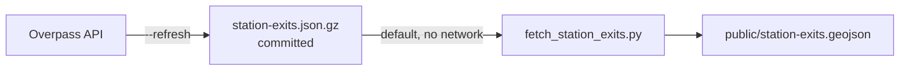

# Station exits (OSM)

`public/station-exits.geojson` is a flat point set of station entrances/exits, rendered as floating green **"EXIT"** badges over the selected station — above the POI dots, below the station pill. When a POI popup is open, the exit physically closest to it turns orange (the "best exit").

## Two phases

The pipeline mirrors the POI build, with the raw Overpass dump committed.

1. **Refresh** (needs network): `python3 data/pois/fetch_station_exits.py --refresh` runs one Overpass query for every `railway=subway_entrance` / `railway=train_station_entrance` node in the station bbox.
2. **Build** (default, no network): `python3 data/pois/fetch_station_exits.py` reads the dump, assigns each entrance to its nearest Link station, precomputes `bearingFromStation`, and writes the GeoJSON.

## Per-feature properties

| Property | Meaning |
| --- | --- |
| `id` | OSM node id |
| `stationKey` | `{lines}-{stopCode}` |
| `stationName` | resolved station name |
| `name` | exit ref or a compass-bearing label |
| `bearingFromStation` | degrees, 0 = north |
| `accessible` | optional, from `wheelchair=yes` |
| `source` | `osm` |

## Best-exit logic

The best exit for an open POI is straight-line nearest (haversine), computed live in the browser by `nearestExit` in `src/stationExits.js` — no API cost. `src/StationExitMarkers.jsx` renders the badges and handles the orange highlight.

## Coverage is partial

Roughly 33 of 38 stations have OSM-mapped exits; the newest south and east-end stations have none yet, so no badges show for them. Seattle has no other subway, so `subway_entrance` nodes are effectively all Link — which is why nearest-station assignment is safe, and it also disambiguates the two stations sharing stop code 54 (Stadium / Judkins Park).

## The contracts

!!! abstract "INV-021 — exits well-formed"
    Every feature has a unique `id`, a `stationKey` resolving to a real station in `all-stations.geojson`, a non-empty `name`, a finite `bearingFromStation` in `[0, 360)`, `source` a subset of `{osm}`, and coordinates inside the padded station bbox.

!!! abstract "INV-022 — exit nearest station"
    Each exit's `stationKey` is the nearest Link station to its coordinates and within the build cutoff (`NEAREST_CUTOFF_M`), so the panel never lists an exit under a station a closer one should own.

Both are checked by `data/pois/test_invariants.py`. See [Core invariants](../invariants.md).
