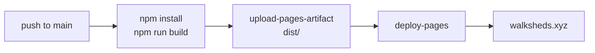
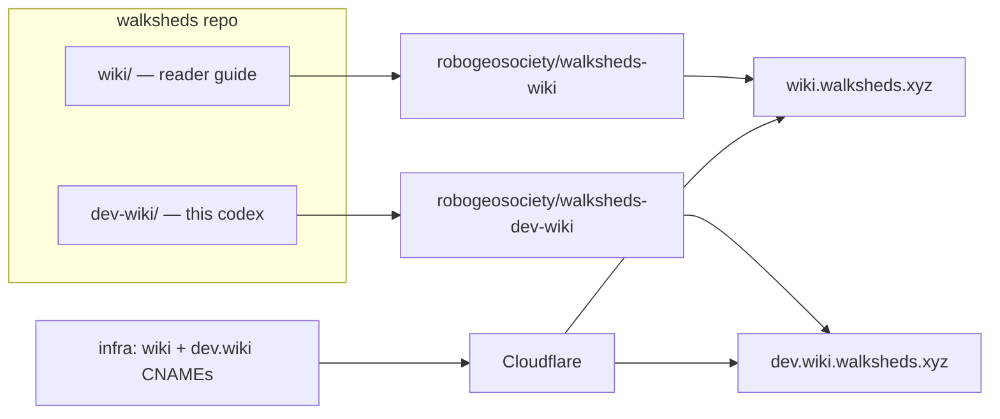

# Deployment + DNS

Walksheds is a static site on GitHub Pages with a Cloudflare-managed custom domain. This codex is a second, sibling site on its own subdomain.

## The main app

`.github/workflows/deploy.yml` builds and deploys on every push to `main`:



The build injects `VITE_MAPBOX_ACCESS_TOKEN` from the `MAPBOX_ACCESS_TOKEN` secret. The job uses `concurrency: { group: pages }` so deploys serialize — the latest finished deploy wins.

### Custom domain

`public/CNAME` contains `walksheds.xyz`. Vite copies everything in `public/` into `dist/` at build time, so the CNAME lands in the artifact and GitHub Pages reads it on deploy.

### Branch previews

To preview a branch on the live URL (overriding main until the next main push), add a per-branch workflow file under `.github/workflows/deploy-preview-<sanitized>.yml`:

1. Sanitize the branch name: `/` → `-`, strip anything outside `[a-zA-Z0-9._-]`.
2. Model it on an existing preview file: `on.push.branches: ['<exact-branch>']` + `workflow_dispatch`, `concurrency.group: pages` (shared with `deploy.yml` so they serialize), and the same build + upload + deploy jobs.
3. Commit and push to the branch — it fires and replaces the live site.
4. `cleanup-merged-preview.yml` on main deletes the file on PR merge, so previews don't accumulate.

The next push to `main` re-deploys main's build and overwrites the preview.

## Cloudflare DNS (Terraform)

DNS for `walksheds.xyz` lives in the `infra/` Terraform module. The Cloudflare provider authenticates with an API token (`var.cloudflare_api_token`, kept in a gitignored `terraform.tfvars`), looks up the zone by name, and manages the records and HTTPS settings.

| Record | Type | Target | Proxied |
| --- | --- | --- | --- |
| `@` (apex) | CNAME (flattened) | `tommyroar.github.io` | yes |
| `www` | CNAME | `walksheds.xyz` | yes |
| `wiki` | CNAME | `tommyroar.github.io` | yes |
| `dev.wiki` | CNAME | `tommyroar.github.io` | yes |

Plus zone settings: `ssl = full`, `always_use_https = on`, `min_tls_version = 1.2`. Apply changes with:

```bash
cd infra
terraform plan
terraform apply
```

## The two documentation sites

Walksheds has two companion sites alongside the app, each on its own subdomain. GitHub Pages allows only one custom domain per repository, so each is its own repo — but both are authored as subdirectories of the main `walksheds` repo for review.

| Site | Subdomain | Audience | Stack | Source dir | Repo |
| --- | --- | --- | --- | --- | --- |
| Guide | `wiki.walksheds.xyz` | readers, riders, advocates | MkDocs Material | `wiki/` | `robogeosociety/walksheds-wiki` |
| Codex (this) | `dev.wiki.walksheds.xyz` | engineers, contributors | MkDocs Material | `dev-wiki/` | `robogeosociety/walksheds-dev-wiki` |



Each site wires up the same way:

- **DNS** — the `wiki` and `dev.wiki` CNAME rows above, in `infra/main.tf`, applied with Terraform.
- **The site** — a root-level `.github/workflows/deploy.yml` (inert while it lives in the main repo, since GitHub only runs root workflows) builds with `mkdocs build --strict` and deploys. The `docs/CNAME` carries the subdomain, which MkDocs copies into the built `site/` root.

!!! note "Operator steps live outside this repo"
    Creating the two Pages repos, enabling Pages on each, and running `terraform apply` are manual steps that touch GitHub and the Cloudflare token — they can't be done from a code change alone. The runbook is tracked as a human task in the dev vault.

### Editing the docs locally

```bash
cd dev-wiki   # or: cd wiki  for the reader guide
pip install -r requirements.txt   # or: uv pip install -r requirements.txt
mkdocs serve                      # live preview at http://127.0.0.1:8000
mkdocs build --strict             # what CI runs; fails on broken links
```
