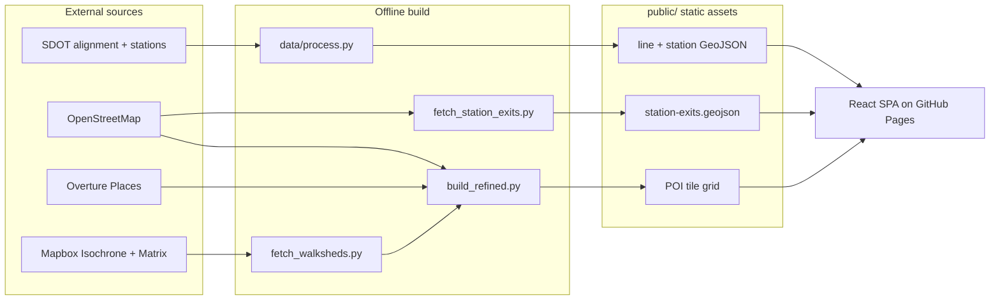

# Walksheds Codex

The reference manual for **Walksheds** — an interactive map of what you can reach on foot from every Seattle Link light rail station.

The live app is at [walksheds.xyz](https://walksheds.xyz). This codex is the engineering companion: how the app is built, where the data comes from, the invariants that keep it honest, and how to operate it.

!!! tip "Looking for the reader's guide?"
    This is the developer-facing codex. If you want the plain-language guide to walksheds, walkability, and riding Seattle Link — how to use the app, what each station is near, the history of the system — head to **[wiki.walksheds.xyz](https://wiki.walksheds.xyz)**.

## What Walksheds is

A single-page React app that draws, for each of the 38 Link stations, the area you can walk to in 5, 10, and 15 minutes — the station's *walksheds* — and pins the points of interest inside them. Pick a station and you get:

- Three nested **isochrone** bands (5 / 10 / 15 minute walk), styled in the Link palette.
- The **points of interest** (restaurants, cafes, bars, shops, museums, parks, and more) that fall inside the 15-minute band, each with the real walking distance to nearby stations.
- The station's **exits**, drawn as floating "EXIT" badges, with the best exit for an open POI highlighted.

It looks like transit cartography on purpose — Vignelli/Beck-lineage diagrams, line-colored routes, station roundels, the official Sound Transit palette: 1 Line `#38B030`, 2 Line `#00A0E0`.

## The shape of the system

Everything left of the app is an **offline build**: the raw source dumps are committed to the repo, so a normal build needs no network. Refresh scripts (each takes `--refresh`) re-pull from the network only when the upstream data actually changes.

## Where to go next

- :material-sitemap: **[Architecture](architecture.md)** — the frontend stack, runtime data flow, and how a station selection becomes pixels.
- :material-palette: **[Design system](design-system.md)** — the Link palette, station pills, iconography, and the no-emoji house rule.
- :material-database: **[Data pipeline](data/overview.md)** — transit, POIs, walksheds, and station exits, source by source.
- :material-shield-check: **[Core invariants](invariants.md)** — INV-001 through INV-022, the contracts CI enforces.
- :material-console: **[Commands](commands.md)** — every npm and Python entry point.
- :material-cloud-upload: **[Deployment + DNS](deployment.md)** — GitHub Pages, the custom domain, Cloudflare/Terraform, and this codex's own subdomain.

!!! note "Source of truth"
    Where this codex and the repository disagree, the repository wins. The canonical short-form references are `CLAUDE.md` (house rules + invariants) and `README.md` (pipeline detail) at the repo root. This codex is the long-form, navigable version of the same knowledge.
